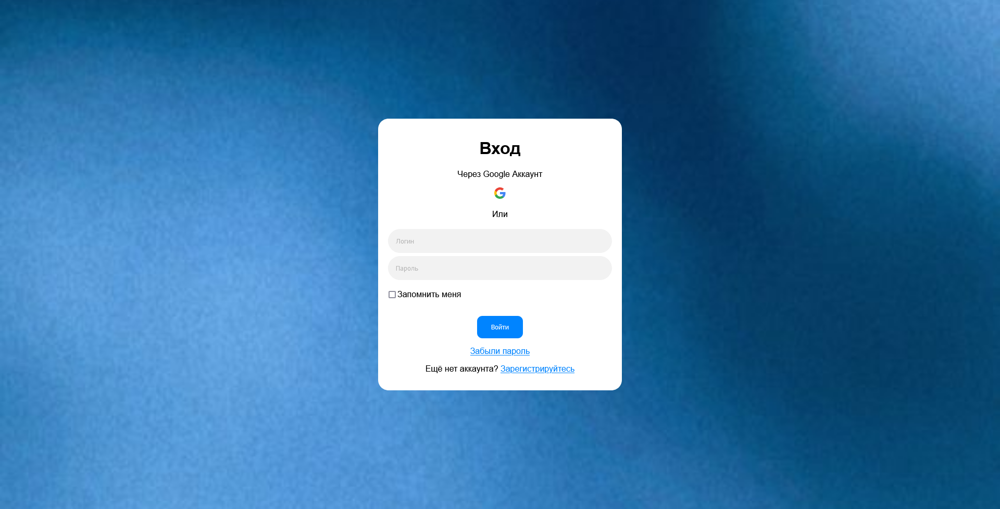

# Hackaton
In the project directory, you can run: `npm start`. Open [http://localhost:3000](http://localhost:3000) to view it in your browser. The page will reload when you make changes.

## Screenshots

SignIn Page:

